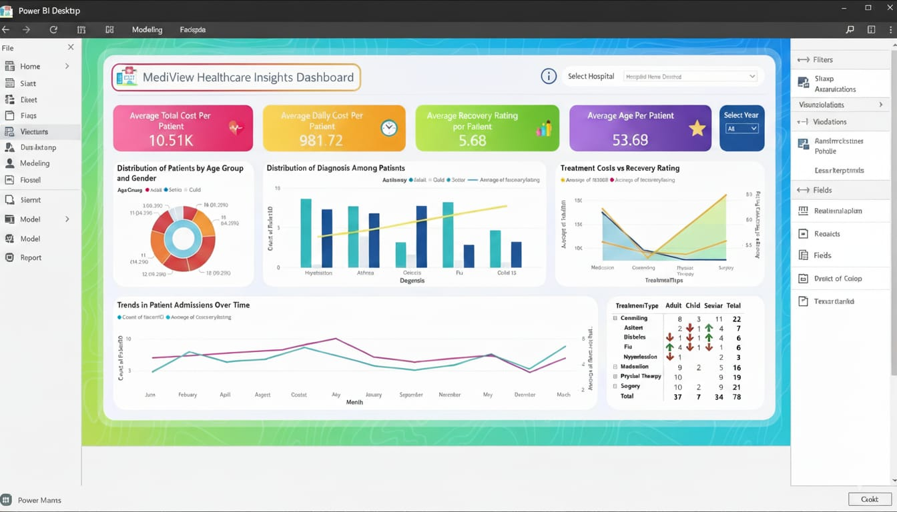

# 🏥 MediView Healthcare Insights Dashboard (Power BI)

## 📌 Project Overview

MediView Healthcare Insights Dashboard is an interactive Power BI report designed to provide a comprehensive overview of hospital performance, patient demographics, treatment effectiveness, and cost behavior across 1,000 patients and 5 hospitals.

The dashboard helps hospitals understand:

- Which treatments are most cost-efficient  
- How patient demographics influence recovery  
- What diagnoses are most common  
- How admission patterns change over time  
- How treatments differ across adults, children, and seniors  

This end-to-end analytics solution supports informed decision-making and drives improvements in both clinical outcomes and operational efficiency.

---

## 🖼️ Dashboard Preview

---

## 📊 Visualizations in the Dashboard

- **🎛️ Top Summary KPI Cards**
  - Average Total Cost per Patient  
  - Average Daily Cost per Patient  
  - Average Recovery Rating  
  - Average Age per Patient  
  - Hospital Selector  
  - Year Filter  

- **Donut Chart:** Patient Distribution by Age Group & Gender  
- **Clustered Bar Chart:** Distribution of Diagnoses  
- **Line & Area Chart:** Treatment Cost vs Recovery Rating  
- **Line Chart:** Patient Admissions Trend Over Time  
- **Matrix Table:** Treatment Performance by Age Group (green ↑ & red ↓ indicators)

---

## ❓ Business Question
**How can hospitals reduce treatment costs while improving patient recovery outcomes across different demographics and diagnoses?**

---

## 🔍 Key Insights

### ⭐ 1. Cost vs Outcome Gaps  
High-cost treatments (e.g., surgery) do not always yield the strongest recovery outcomes.  
→ Hospitals can reduce expenses by increasing use of mid-cost, high-recovery treatments.

### ⭐ 2. Diagnosis Trends  
Conditions like hypertension, asthma, obesity, flu, and COVID-19 show different recovery patterns across age groups.  
→ Enables targeted interventions.

### ⭐ 3. Age-Based Differences  
- Seniors show the widest variability in cost and recovery  
- Children show generally stable outcomes  
→ Supports age-tailored treatment approaches.

### ⭐ 4. Admission Seasonality  
Admissions fluctuate by month, impacting staffing and resources.  
→ Hospitals can optimize workforce and bed availability.

---

## 🛠️ Tools & Skills Used

### 🔧 Tools  
- Power BI Desktop  
- Excel  

### 📈 Skills  
- Data Modelling  
- DAX Measures  
- Interactive Report Design  
- Insight Interpretation  
- Healthcare Analytics  

---

## 📁 Dataset Overview

### Patient Data  
- Age, Gender, Blood Type  
- Diagnosis  
- Treatment  
- Admission & Discharge Dates  
- Total Cost  
- Recovery Rating  

### Hospital Data  
- Hospital Name  
- Doctor Name  
- Room Details  
- Daily Costs  
- Treatment Type  

---

## 🚀 Key Features

✔ Modern UI with bright, friendly colors  
✔ Clean KPI tiles for fast insights  
✔ Interactive slicers (Hospital, Year)  
✔ Trendline analytics  
✔ Treatment performance matrix with indicators  
✔ Ideal for clinical + operational teams  

---

## ▶️ How to Use the Dashboard

1. Open the `.pbix` file in Power BI Desktop  
2. Apply filters (hospital, year, diagnosis, age group)  
3. Explore insights across cost, recovery, admissions, and treatment performance  
4. Export visuals for presentations  

